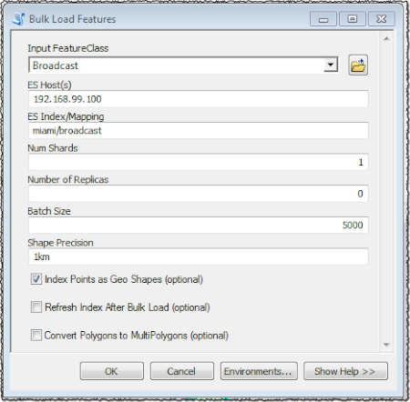
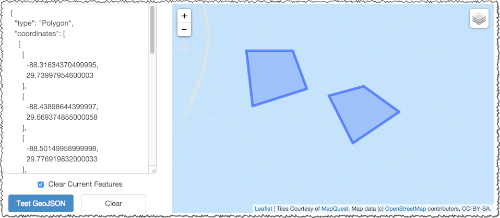
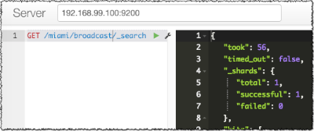
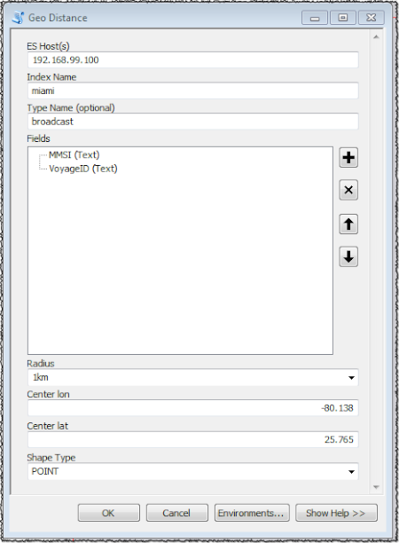

# Bulk Load Features from ArcGIS Into Elasticsearch 



## Description

This [ArcPy](http://help.arcgis.com/en/arcgisdesktop/10.0/help/index.html#//000v000000v7000000.htm) based tool uses the [Python Elasticsearch Client](http://elasticsearch-py.readthedocs.org/en/latest/index.html) API to bulk load the content of a feature class into Elasticsearch using the [bulk](https://www.elastic.co/guide/en/elasticsearch/reference/current/docs-bulk.html) REST API.

The tool retrieves the description of the fields in a specified feature class and creates an index [mapping](https://www.elastic.co/guide/en/elasticsearch/reference/current/mapping.html) before the bulk import starts.

The geometry of point features can be stored as [geo_points](https://www.elastic.co/guide/en/elasticsearch/reference/current/mapping-geo-point-type.html) or [geo_shapes](https://www.elastic.co/guide/en/elasticsearch/reference/current/mapping-geo-shape-type.html). The geometry of polyline or polygon features is stored as an instance of `geo_shape`.

Each feature is converted it to a [JSON](https://en.wikipedia.org/wiki/JSON) document. In the case where the geometry of the feature is of type (multi)linestring or (multi)polygon, then it has to be converted to a [GeoJSON](https://en.wikipedia.org/wiki/GeoJSON) element in the document.

*Note:* There is a little hidden gem in ArcPy, where you can get the GeoJSON representation of a geometry by accessing its `__geo_interface__` property.

Here is a mapping snippet:

```
{
    "properties": {
        "shape": {
            "type": "geo_shape",
            "tree": "quadtree",
            "precision": "1km"
        }
    }
}
```

Here is an ArcPy snippet:

```
with arcpy.da.SearchCursor(fc, ['SHAPE@']) as cursor:
    for row in cursor:        
        geojson = row[0].__geo_interface__
        doc = {"shape":geojson}
```
 
There is a small "issue" in ES when it comes to polygons with multi parts, where the parts are siblings such as in the `polygon.json` file.
Here is the view in [geojsonlint.com](http://geojsonlint.com) that reports that the content of `polygon.json` is valid.



However, posting it using the bulk API:

```
curl -XPOST localhost:9200/_bulk --data-binary @request
```

Results in the following error:

```
{
	"took": 4,
	"errors": true,
	"items": [{
		"index": {
			"_index": "miami",
			"_type": "extent",
			"_id": "1000",
			"status": 400,
			"error": "MapperParsingException[failed to parse [shape]]; nested: InvalidShapeException[Invalid shape: Hole is not within polygon]; "
		}
	}]
}
```

To get around this, there is an option in the tool to convert `Polygons` to `MultiPolygons`. Make sure to check that on !


## Trying The Tool

Download the [sample AIS data](http://marinecadastre.gov/ais/) in [FileGeodabase](http://www.esri.com/news/arcuser/0309/files/9reasons.pdf) format.
It contains a point feature class of 1.3 million ship locations with timestamps, headings, ship identifiers (MMSI) and more attributes.
 
### Starting Elasticsearch.

We will use [Docker](https://www.docker.com/) to create a local instance of [Elasticsearch](https://hub.docker.com/_/elasticsearch/) using the new [Docker Toolbox](https://www.docker.com/toolbox).

```
docker-machine create --driver virtualbox --virtualbox-memory "4096" --virtualbox-cpu-count "4" dev
export DEV=$(docker-machine ip dev)
eval "$(docker-machine env dev)"
```

Start an ES instance based on developer centric configuration files in the `config` folder. 

```
docker run -d -p 9200:9200 -p 9300:9300 -h dev -v "$PWD/config":/usr/share/elasticsearch/config elasticsearch
```

*Note:* The `dev` value to the `-h` option defines the container host name - this is hardcoded in the `config/elasticsearch.yml` for easy discovery, development and testing.

Check if ES is up and running:

```
open http://$DEV:9200
```

This should result in something like the following:

```
{
	status: 200,
	name: "Akhenaten",
	cluster_name: "elasticsearch",
	version: {
		number: "1.7.1",
		build_hash: "b88f43fc40b0bcd7f173a1f9ee2e97816de80b19",
		build_timestamp: "2015-07-29T09:54:16Z",
		build_snapshot: false,
		lucene_version: "4.10.4"
	},
	tagline: "You Know, for Search"
}
```

### Invoking the Bulk Loader Tool

Update your `PATH` system environment variable to include Python. In my case it looks like:
 
```
C:\Python27\ArcGIS10.3;C:\Python27\ArcGIS10.3\Scripts
```

Then use [pip](https://pip.pypa.io/en/latest/installing.html) to install elasticsearch.

```
pip install elasticsearch
```

Start ArcMap and add from `miami.fgb` the `Broadcast` feature class.
Open the `Bulk Load Features` tool in the `ElasticsearchToolbox.pyt` toolbox. 


The `ES Host(s)` value is the return of the `docker-machine ip dev` command on the host, and make sure to check the `Index Points as Geo Shapes` for this walk through.

*Note:* This process takes about 20 minutes on my MacBook Pro with ArcMap running in WMWare Fusion and ES in VirtualBox, so...go and grad a cup of coffee or clean your office :-) This is _not_ the most efficient way to bulk load features into ES. One of these days will have to come back and rewrite this tool to take advantage of massive parallel reading.

Using [Sense](https://chrome.google.com/webstore/detail/sense-beta/lhjgkmllcaadmopgmanpapmpjgmfcfig?hl=en) in Chrome (You _are_ using Chrome, right? I mean, what else is there?), perform the following query:
 


### Invoking the Geo Search Tool

I like ES because it can store and spatially query spatial types. The `GeoSearchTool` relies on the [Geo Distance Filter](https://www.elastic.co/guide/en/elasticsearch/reference/current/query-dsl-geo-distance-filter.html) to query all documents that are within a radius distance from a specified location.


 
Note that the `Type Name` property is optional, as the tool will query the _whole_ index if the `Type Name` value is blank.
The field mapping property enables the user to define what properties to retrieve from the queried documents. Some properties might be included in some documents and others will not be.  That is the beauty of document stores.
However, ArcGIS FeatureClasses still have a row/column model and non-existing document properties will be populated as null values in the feature attributes.

*TODO:* On `Index Name` and `Type Name` parameter updates, query ES for the mapping and auto populate the `Fields` parameter.

## Final Notes
 
You can gracefully shutdown ES using:

```
curl -XPOST $(docker-machine ip dev):9200/_cluster/nodes/_shutdown
```

An ES node publishes its IP to communicate with it. However in this case, it publishes it _docker_ container IP typically in the form `127.17.0.XXX`. So on my mac, I had to reroute the traffic when communicating with it using:

```
sudo route add -net 172.17.0.0/16 $(docker-machine ip dev)
```

You can get the internal docker IP using the following to get the list of the containers:

```
docker --tls ps
```

Find the active CONTAINER_ID from the list, and replace it in the following command:

```
docker --tls inspect -f=“{{.NetworkSettings.IPAddress}}” CONTAINER_ID
```
